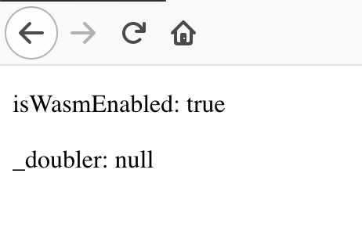
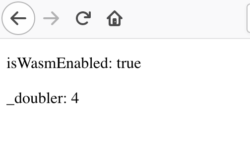

This repository contain tools for develop modern frontend with WebAssembly (React, Vue, Babel and etecetera). 

Please don't use it in production. It's not stable yet.

### 


#### Create a project with WASM in less than 5 minutes (optional)

```
curl -o- -L https://raw.githubusercontent.com/raphamorim/wasm/master/scripts/create-project.sh | bash
```

## Supported Languages

| Language | Status | Notes |
| :---         | :---         | :---         |
| C++   | Under development     | Still very experimental    |
| Rust     | Under development       | Test phase      |
| Go     | On Roadmap       | -      |
| Python     | On Roadmap       | -      |
| Kotlin     | On Roadmap       | -      |
| Lua     | On Roadmap       | -      |

#### Summary

- [`xwasm` Packager to WebAssembly](#xwasm)
- [`emscripten` Node API for Emscripten SDK](#emscripten)
- [`babel-plugin-wasm` Convert C++/Rust code to WASM in the babel parse](#babel-plugin-wasm)
- [`useWasm` React Hook for load WASM files](#usewasm)
- [Examples](#examples)
  - [React + C++](#react--c)
  - [Babel + React + C++](#react--babel--c)
  - [Babel + React + Rust](#react--babel--rust)
- [FAQ](#faq)
- [TODO](#todo)
- [References](#references)

## `xmasm`

WebAssembly Packager (understand ~or should~ Rust/C/C++/Go/Python).

## `emscripten`

Node module for [Emscripten SDK](https://github.com/emscripten-core/emsdk) API. It will try to install SDK if you don't have Emscripten installed.

Note: Only OS X and Linux support. Windows support in development.

#### Installation

It's going to install Emscripten SDK on postinstall hook.

```bash
npm install emscripten
```

#### CLI Usage

1. Create a file: `emcc.config.js`

```jsx
const filesToProcess = [
  {
    input: 'doubler.c',
    output: 'doubler.wasm',
    functions: '["_doubler"]'
  }
]

module.exports = filesToProcess;
```

2. Now if you run `emscripten build`, it's going to load the configuration above. If you want to, you can add it before any build task. For example:

```json
"scripts": {
  "build": "emscripten build && webpack",
``` 

#### Module Usage (Not available yet, still under development)

###### `is_north.rs`

```rust
#[derive(Debug)]
enum Direction { North, South, East, West }

fn is_north(dir: Direction) -> bool {
    match dir {
        Direction::North => true,
        _ => false,
    }
}

fn main() {
    let points = Direction::South;
    println!("{:?}", points);
    let compass = is_north(points);
    println!("{}", compass);
}
```

###### `index.js`

```jsx
import path from 'path';
import Emscripten from 'emscripten';

const emcc = new Emscripten();
const isNorthPath = './is_north.rs';
const emmc.buildFile({
  input: path.resolve(__dirname, isNorthPath),
  output: path.resolve(__dirname, 'is_north.wasm'),
  wasm: true
});
```

## `useWasm`

### Installing

```bash
$ npm install use-wasm
```

### Usage

C++ code

```cpp
int _doubler(int x) {
  return 2 * x;
}
```

JSX code with React

```jsx

import React, { Fragment, Component } from 'react';
import { render } from 'react-dom';
import useWasm from 'use-wasm';

function App() {
  // method will initialize null til load the "./doubler.wasm"
  const { isWasmEnabled, instance } = useWasm('doubler');

  return (
    <Fragment>
      <p>isWasmEnabled: {String(isWasmEnabled())}</p>
      <p>_doubler: {String(instance && instance._doubler(2))}</p>
    </Fragment>
  );
}

render(<App/>, document.querySelector('#root'));

```

###### Instance loading (`null` as initial value)

 

###### Instance loaded (wasm export object as value)



## `babel-plugin-wasm`

!! Still under development !!

#### Installation

```sh
$ npm install babel-plugin-wasm
```

## Examples

#### React + C++

[Read the code](./docs)

#### React + Babel + C++

On going...

#### React + Babel + Rust

On going...

## TODO

- [ ] useWasm: Cache logic for fetching WASM files
- [ ] Emscripten: Cache for build
- [ ] Emscripten: Add support for Windows
- [ ] Emscripten: Add support for load different files into one export
- [ ] Write examples using Rust 

## References

- https://webassembly.org/getting-started/developers-guide
- https://emscripten.org/docs/compiling/WebAssembly.html
- https://developer.mozilla.org/en-US/docs/WebAssembly
- https://developer.mozilla.org/en-US/docs/WebAssembly/C_to_wasm
- https://developer.mozilla.org/en-US/docs/WebAssembly/Using_the_JavaScript_API
- https://developer.mozilla.org/en-US/docs/Web/JavaScript/Reference/Global_Objects/WebAssembly/Memory
- https://github.com/emscripten-core/emscripten/issues/8126
